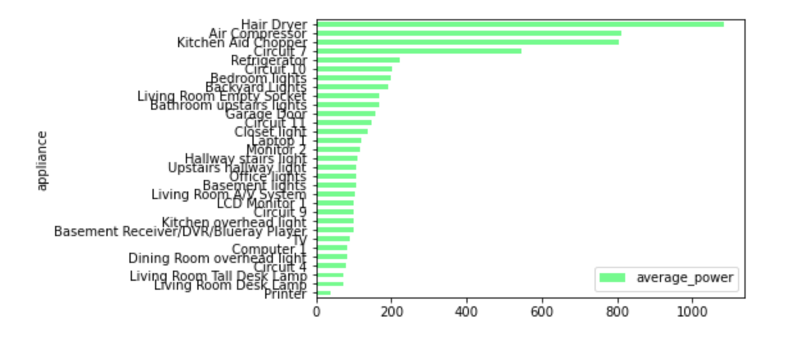
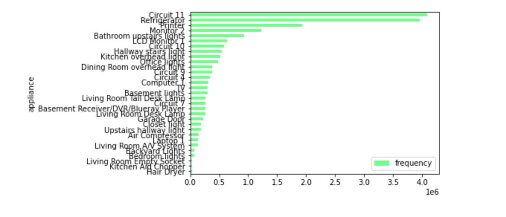

# Appliance-Electricity-Big-Data-Analysis-With-Spark
# Executive Summary
This project focuses on preprocessing an event-based non-intrusive load monitoring dataset, exploratory analysis and simple modeling to explore the insight of the dataset. 

# Introduction
Dataset used and Initial plan:
- Our dataset is Building-Level fully labeled Electricity Disaggregation dataset, the dataset contains high-frequency (12 kHz) household-level data from a single American household within approximately 8 days. The data set also contains a list of events that involves changing the status of each device in the home (such as turning on the microwave).(http://portoalegre.andrew.cmu.edu:88/BLUED/)
- Each compressed package contains 400 voltage and current compressed packages, A-phase event list, B-phase event list and AB-phase event list, four mat data compressed files of power data, and after decompression is a txt text containing the file header , The following data are time, phase A current, phase B current, phase A voltage
- Our initial plan is:
   - Ingested the dataset
      - Extract contents from the several raw compressed folder.
      - Reformat the data from the raw format.
      - Add some necessary features using regular expression/loop function.
   - Exploratory analysis
      - Evaluete the rank of power, resistances and explore potential valuable information of different appliances.
   - Build prediction model
      - Preprocess the string column, which is prepared to be one of the steps in the model pipeline
      - Using Random Forest classfier to predict which appliance is working based on the basic electricity data from the sensor.
      - Build model pipeline to do the prediction.
   
# Exploratory analysis 
As we stated in the above introduction section, we filtered the content we are looking for from numerous fragmentary files through python program, uploaded the proceed files to the cloud bucket, extracted information through SQL query and finally built the model and prediction. We will elaborate the analysis process later in the following sections. 

Insights learned from the data:
- The most frequently used appliance of the whole day are circuit 11, refrigerator and printer.
- The most powerful used appliance are hair dryer, air compressor and kitchen chopper.
- And more importantly, through the analysis, we realized that dealing with the dateset itself sometimes might be tough and challenge especially in the real case. However, we would like to overcome all the difficulties.

# Methods section
- Ingested the data:
    - extracted the contents from thousands single files using python program(see ingested_data.py) and uploaded data to the S3 bucket.
- Cleaned, prepared the dataset:
    - grouped .csv files by application device code using pyspark and regular expression(see final_project.ipynb preprocessing part).
    - created new columns indicating the corresponding code and name of application device.
    - combined into a PySpark.sql.dataframe.
- Data visualization:
    - We mainly used SQL query to manipulate and analyze the data, and then visualized results. We believed visualization is a good way for audience to directly and easily understand our explored information behind the tedious dataset.
    - We first created a graph to show the average-power consuming.
    - Also, we visualized the resistance of appliances.
    - At last, we visualized the using time of the different appliances.
- Modeling the dataset:
    - We randomly splited data into: training data, test data, and prediction data.
    - Create pipeline and training model:
        - We created transtormers and a geature vector by combining all string features together
        - Then we built the classifier and fitted the model.
    - Using test data to check model accuracy
    - predict data
        - We used "X_Value","Current A","Current B", "VoltageA", "power", "Absolute_power","resistance" of the appliace as the input value to try to predict which appliance is on using when we collect the data from the smart sensor from the home. But afte we built the model, we fonud that the performance of the predictive model is not as goog as our imagined, which means there are a lot of challenges we still need to be fix in the future to better predict the result.
        - Accuracy = 0.463237
        - Test Error = 0.536763
 
      

 
# Results and Conclusions
Findings:
- Top 5 average-power consumer: Hair Dryer, Air Compressor, Kitchen Aid Chopper, Circuit 7 and Refrigerator
- Top 5 resistance: Printer, Living Room Desk Lamp, Living Room Tall Desk Lamp, Circuit 4, and Computer
- Top 5 using time: Circuit 11, Refrigerator, Printer, Monitor 2 and Bathroom upstaris lights.
- The high-frequency used applianced is also the applainces that need to be kept turning on such as refrigerator and printer. 

